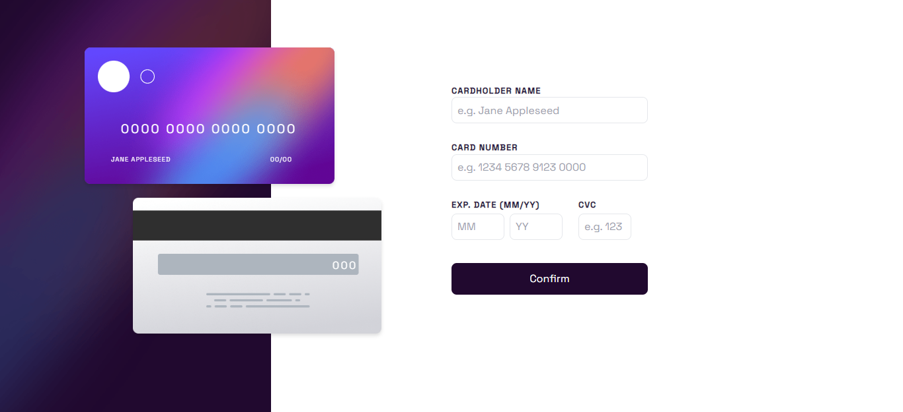

<h1 align='center'>Interactive card details form</h1>
</br>
<p align='center'>Usando um layout responsivo e técnica de state-management, portfólio construído para divulgação de meus projetos pessoais</p>


<br/>

<h2>Stack utilizada 🛠</h2>
<p><b>Front-end:</b> React, TailwindCSS, Vite, styled-Components, context-api</p>

</br>

## Instalação ⚙

Instale Meu Portfólio com npm

```bash
  git clone https://github.com/jonas-nb/MeuPortfolio
  cd InteractiveCard
  npm install
  npm start
```

<br/>

## Deploy ☁

Para fazer o deploy desse projeto rode

```bash
  npm run build
```

<br/>

## Autores 🖊

-   [@jonas-nb](https://www.github.com/jonas-nb)
